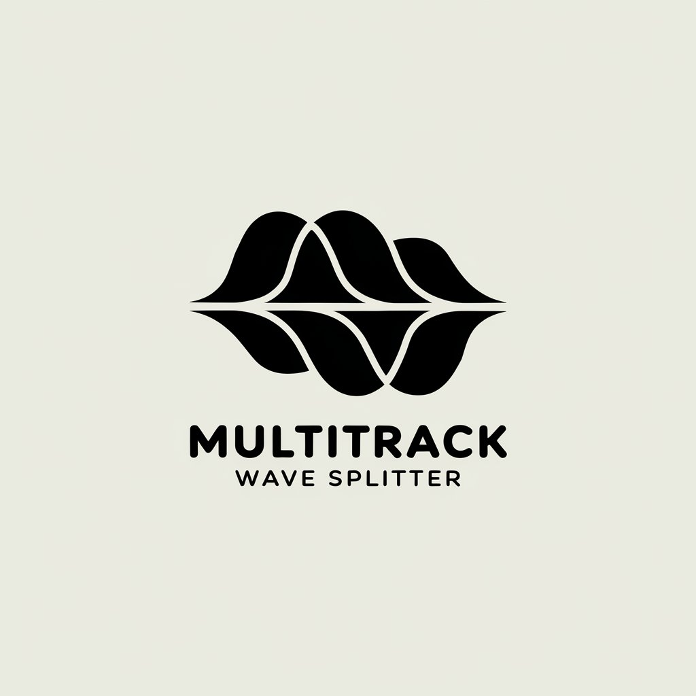

# Multitrack WAV Splitter

<p align="center">
  
</p>

Split a multitrack WAV file into individual mono WAV files. Useful when recording with a **Behringer X32** and the **X-Live** expansion card: the session is saved as one multitrack WAV on the SD card, but DAWs like **Studio One** expect one mono WAV per track. This tool does the split.

## Features

- **CLI tool** – Split multitrack WAV from the command line.
- **Browser GUI (WASM)** – React app that runs the splitter in the browser via WebAssembly: drop a WAV file and download individual mono tracks.
- **PCM only** – Supports standard uncompressed PCM WAV (any channel count, common bit depths).
- **Interleaved format** – Correctly deinterleaves multichannel samples (Ch1-S1, Ch2-S1, … ChN-S1, Ch1-S2, …) into one mono file per channel.

## Installation

### From source

```bash
git clone https://github.com/bbu/multitrack-wav-splitter.git
cd multitrack-wav-splitter
go build -o mtwav-split ./cmd/mtwav-split
```

### Cross-compilation (all platforms)

Use the provided Makefile:

```bash
make build-all
```

This produces binaries in `build/` for:

| OS      | Architectures |
|---------|----------------|
| Windows | amd64, arm64  |
| Linux   | amd64, arm64  |
| macOS   | amd64, arm64  |

Single target examples:

```bash
make build-windows-amd64   # build/mtwav-split-windows-amd64.exe
make build-linux-arm64     # build/mtwav-split-linux-arm64
make build-darwin-amd64    # build/mtwav-split-darwin-amd64
make build-darwin-arm64    # build/mtwav-split-darwin-arm64 (Apple Silicon)
```

## Usage

```text
mtwav-split -input <multitrack.wav> [-output <dir>] [-pattern <pattern>]
```

| Flag       | Description |
|------------|-------------|
| `-input`   | Path to the multitrack WAV file (required). |
| `-output`  | Output directory for mono WAV files (default: current directory). |
| `-pattern` | Filename pattern; `%d` is replaced by the 1-based track number (default: `track_%03d.wav`). |

### Examples

Split `session.wav` in the current directory, creating `track_001.wav`, `track_002.wav`, …:

```bash
./mtwav-split -input session.wav
```

Split into a specific folder with a custom naming pattern:

```bash
./mtwav-split -input /path/to/recording.wav -output ./stems -pattern "channel_%d.wav"
```

## Output

- One mono WAV per channel, same sample rate and bit depth as the source.
- Channel order matches the multitrack file (e.g. channel 1 → `track_001.wav`).

## Browser GUI (WASM)

A React app runs the splitter in the browser via Go-compiled WebAssembly. No server upload: the WAV is processed locally.

- **Performance note**: For large multitrack recordings, the **CLI is significantly faster and more robust** than the browser GUI. Prefer the CLI when splitting long X32/X-Live sessions, and use the GUI for convenience and smaller files.

### Build and run

1. **Build the WASM module and copy the Go runtime script:**

   ```bash
   make wasm
   ```

   This produces `web/public/mtwav-split.wasm` and copies `wasm_exec.js` from your Go installation into `web/public/`.

2. **Install dependencies and run the dev server:**

   ```bash
   cd web && npm install && npm run dev
   ```

   Open the URL shown (e.g. http://localhost:5173), drop a multitrack WAV file, then download the split mono files.

3. **Production build:**

   ```bash
   cd web && npm run build
   ```

   Serve the `web/dist/` directory with any static file server (e.g. `npx serve web/dist`).

### File size and streaming (browser)

- **Split in browser** (WASM): For files up to **400 MB**. The whole file is loaded into memory, so larger files will run out of memory.
- **Stream to folder**: For **files of any size** (including multi-GB), use **Stream to folder**. The app will ask you to choose an output directory (via the [File System Access API](https://developer.mozilla.org/en-US/docs/Web/API/File_System_Access_API)); the file is read and written in chunks, so memory stays bounded (tens of MB). Supported in **Chrome** and **Edge**. For Firefox or Safari, use the **CLI** for large files.

### Requirements

- Go 1.21+ (for building the WASM binary).
- Node.js 18+ (for the React app). `wasm_exec.js` is copied from `$(go env GOROOT)/lib/wasm/` or `misc/wasm/` depending on your Go version.

## Testing

```bash
go test ./...
```

## License

CC0 1.0 Universal. See [LICENSE](LICENSE).

## Roadmap

- Optional: “Download all as ZIP” in the browser GUI.
